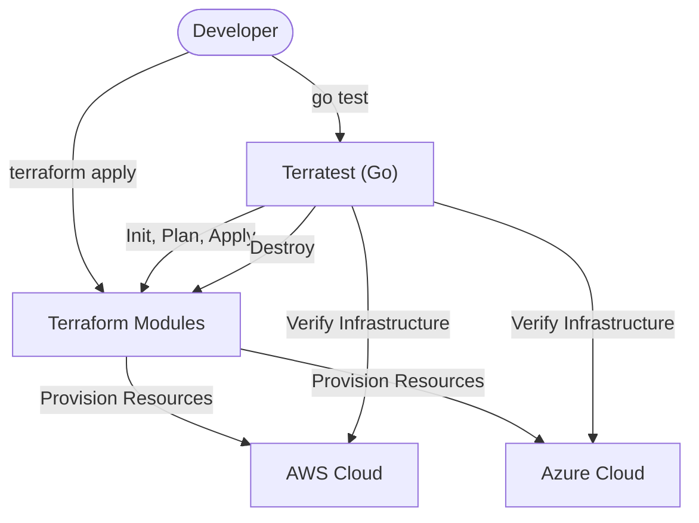

# Architecture — multi-cloud-terraform-modules
> Last updated: 2026-08-29 | Maturity: Partial Prototype
> _Multi-cloud Terraform modules with Terratest._

## System Diagram
The following Mermaid.js sequence diagram maps the core workflow and interactions:

## Component Table

| Component | File | Responsibility | Tech |
|---|---|---|---|
| AWS Modules | `modules/aws/` | EKS, RDS, S3 definitions | HCL |
| Azure Modules | `modules/azure/` | AKS, CosmosDB, BlobStorage | HCL |
| Terratest | `tests/` | Automated provisioning/testing | Go |

## Dependency Honesty Table

| Dependency | Status | Notes |
|---|---|---|
| Terraform | **Real** | Modules are standard HCL and compile successfully. |
| Terratest | **Real** | Tests are implemented in Go. |
| AWS / Azure | **Optional** | E2E testing requires real cloud accounts; CI simulates this. |

## Design Philosophy
Every module follows three principles: **secure by default**, **opinionated defaults**, and **testable**.

### Secure by Default
- All storage modules enable encryption at rest (KMS for AWS, platform-managed for Azure)
- All database modules disable public access
- All S3/Blob modules block public ACLs
- All Kubernetes clusters use private API endpoints by default

### Opinionated Defaults
Rather than exposing every possible variable, modules ship with sane defaults that match what SRE teams actually deploy. Consumers can override, but the "happy path" is already secure and production-ready.

### Tested
Terratest validates that every module:
1. Initializes correctly (`terraform init`)
2. Validates syntax (`terraform validate`)
3. Plans without errors against the given variables

## Module Comparison: AWS vs Azure

| Capability | AWS Module | Azure Module |
|------------|-----------|-------------|
| Kubernetes | EKS + Managed Node Groups | AKS + System/User Node Pools |
| Database | RDS PostgreSQL (Multi-AZ) | Cosmos DB (Geo-Replicated) |
| Storage | S3 (KMS, Versioning, Logging) | Blob (Soft Delete, Versioning, TLS 1.2) |